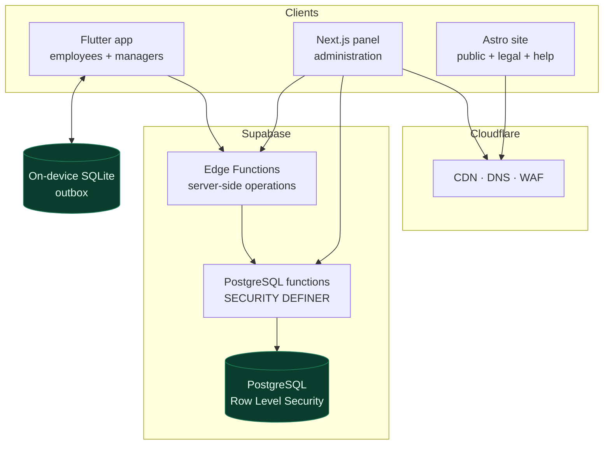

# WorkTracker — Engineering Case Study

WorkTracker is a workforce time-tracking product for Spanish small and mid-sized companies.
Employees record their workday from a mobile app that keeps working without network. Managers
review incidents and corrections, and the company keeps a traceable four-year record of what
happened and who changed it.

This repository is a public case study. It contains design documents, architecture decision
records, and diagrams. It contains no product source code.

**Live product:** [worktracker.es](https://worktracker.es)

## My role

I am the only engineer on the product. I own the product decisions, the architecture, the
implementation across mobile, web, backend and data, the deployment pipeline, and the
engineering system that AI agents work inside. I have been building it since August 2025,
alongside full-time employment as a software engineer.

## Current status

The product is deployed and usable. The web panel and public site are live. The mobile
applications are distributed as beta builds through a closed Google Play test and TestFlight.

WorkTracker does not yet have meaningful commercial traction, and this case study makes no
claims about users, revenue or adoption. What it documents is the engineering: the decisions,
the constraints that shaped them, and the system that keeps a single engineer shipping
reliable changes.

## Architecture at a glance

The Flutter app is the employee client and works offline. The Next.js panel is deliberately
scoped to administration. Every write that matters passes through a server-side boundary, and
PostgreSQL Row Level Security is the last line of defence rather than the only one.

## Where to go next

| Document | What it covers |
|---|---|
| [Architecture](docs/architecture.md) | Surfaces, boundaries, deployment topology, and why the system is split this way |
| [Offline-first](docs/offline-first.md) | Why clocking must work without network, the outbox model, retry and failure behaviour |
| [Security and multi-tenancy](docs/security-and-multitenancy.md) | Company isolation, capability-based authorization, append-only audit history |
| [Compliance by design](docs/compliance-by-design.md) | Turning Spanish and EU recordkeeping duties into product and schema requirements |
| [AI-assisted engineering workflow](docs/ai-engineering-workflow.md) | How agents are scoped, constrained, reviewed, and how failures become rules |
| [Failure case: the UTC display regression](docs/failure-case-timezone.md) | A real defect, its root cause, and the six changes made so the class cannot recur |
| [Decision records](docs/adr/) | Nine ADRs covering the decisions with real trade-offs |

## Engineering challenges worth reading about

**Offline clocking that cannot duplicate records.** A clock-in is a labour record with legal
weight. It has to survive a phone with no signal, and it must not turn into two records when
the phone reconnects and the user has retried. The answer is an outbox in local SQLite with a
client-generated idempotency key that the server honours for 72 hours.
See [offline-first](docs/offline-first.md).

**Time that means the same thing on every surface.** A workday belongs to a calendar date, but
the device, the server and the company are not necessarily in the same timezone. A production
bug forced this into a single cross-surface contract enforced by custom lint rules and an
immutable per-workday timezone snapshot in the database.
See [the failure case](docs/failure-case-timezone.md).

**Authorization that does not depend on role names.** Permissions resolve from capabilities
held server-side, not from string comparisons against a role label in the client.
See [security and multi-tenancy](docs/security-and-multitenancy.md).

**Regulatory constraints as engineering requirements.** Four-year retention, append-only
history and attributable corrections are not features. They are properties the schema has to
guarantee. See [compliance by design](docs/compliance-by-design.md).

**Keeping AI agents inside a disciplined process.** Agents write a large share of the code.
They work from scoped tasks, versioned guidelines and a product knowledge base, and they are
constrained by runtime hooks and custom lint rules that block specific failure modes before a
file is written. See [the workflow](docs/ai-engineering-workflow.md).

## What you will not find here

Product source code, database schemas, RLS policy definitions, RPC signatures, edge function
internals, infrastructure configuration, or customer data. The security documents describe
boundaries and patterns, not the enforcement details themselves.

## Links

- **Product:** [worktracker.es](https://worktracker.es)
- **Author:** Luciano Plaza — [LinkedIn](https://linkedin.com/in/luciano-plaza-grueso) · [GitHub](https://github.com/Gaan21)

---

Documentation repository. Not a runnable codebase.
