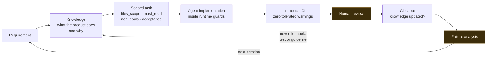

# AI-assisted engineering workflow

AI agents write a large share of the code in WorkTracker. That is only worth writing down
because of what surrounds them.

The interesting problem is not prompting. It is that an agent will confidently produce
plausible code that violates an architectural rule established six months ago in a repository
it has not read, and will do it faster than anyone can review. Speed of generation is only
useful if the cost of a wrong change stays low. Everything below exists to keep that cost low.

The position this system takes: **AI accelerates execution. Architecture, validation, product
judgement, security and quality stay deliberate engineering responsibilities.**

## The loop



The feedback edge is the part that matters. A failure that produces only a fix is likely to
repeat. A failure that produces an enforceable rule is much less likely to.

## Two sources of authority

Agent instructions in every repository distinguish two questions that are easy to conflate.

**How to implement** lives in a private guidelines repository, included in each product
repository as a git submodule at `_guidelines/`. It is organized as reusable engineering
guideline modules, one per topic, covering each stack the product uses — Flutter, Supabase,
Next.js and Astro — plus shared git and agent conventions. It is versioned with its own
changelog under a `guides@vX.Y.Z` scheme, so a repository pins a known revision rather than
tracking a moving target. Modules are authored once and generated into per-runtime instruction
files, so the same rule reaches different agent runtimes without being maintained three times.

**What the product does and why** lives in a separate product knowledge base: business rules,
role capabilities, flows, surfaces, decisions, risks, and the cross-surface contracts. It is
implementation-independent. An agent working in the mobile repository and an agent working in
the panel repository read the same description of a business rule.

The instructions state which wins: if a technical guideline and the product knowledge base
disagree about a product behaviour, the knowledge base is authoritative and the guideline is
flagged as stale. Without that rule, two plausible sources contradict each other and the agent
picks one, silently.

## Scoped tasks

A task is a file with a frontmatter contract. The fields that do the work:

```yaml
id: TASK-YYYYMMDD-XX
size: S                      # XS | S | M | L
must_read:                   # product context: business rules, contracts, decisions
  - product/features/<feature>.yml
preload:                     # specific guideline files to read BEFORE writing code
  - _guidelines/<stack>/00_SUMMARY.md
  - _guidelines/skills/<leaf-skill>/SKILL.md
dependencies: []             # blocking tasks
files_scope:                 # delimits what may change
  - lib/**
ask_policy: AskForMissingContext
non_goals:                   # what this task must NOT do
  - Change domain contracts
acceptance_criteria: []
definition_of_done: []
```

Four of these fields exist because of specific failures.

`files_scope` exists because an agent asked to fix a view model will refactor an unrelated
repository on the way past, and the diff is large enough that nobody notices.

`non_goals` exists because "while I was here" changes are how a small task acquires an
architectural decision nobody made.

`preload` names concrete files rather than skill names, because an agent given a category
picks the document that looks most relevant and skips the invariants.

`ask_policy` exists because the alternative to asking is inventing.

Task state is derived from which folder the file sits in — backlog, doing, done — and the
instructions explicitly forbid a conflicting status field in the frontmatter. One source of
truth for state, and it is the one that cannot silently disagree with itself.

There are also two paths. Questions, analysis and small documentation changes take a fast path
with no branch, no backlog entry and no mandatory gates. Behaviour changes, new logic and new
files take the full path. When in doubt, the instructions say use the full path.

## Runtime guards

Guidelines are advisory. An agent that has read a rule can still break it. So some rules are
enforced at the moment the agent tries to act, as pre-tool hooks that inspect the intended
change and can refuse it.

Sanitized illustration of the shape:

```bash
# PreToolUse hook: runs before Edit or Write
# Exit 0 = allow, exit 2 = block with a message the agent receives

INPUT=$(cat)
FILE=$(echo "$INPUT" | jq -r '.tool_input.file_path // empty')

[[ "$FILE" != *.dart ]] && exit 0

# generated files are excluded: codegen emits legitimate suppressions
case "$FILE" in
  *.g.dart|*.freezed.dart|*.mocks.dart) exit 0 ;;
esac

# a lint suppression without a traceable approval tag is refused
```

Two guards matter most.

**Lint suppressions are blocked.** Agents suppress. Faced with a rule they cannot satisfy, an
`// ignore:` comment makes the error disappear and the task complete successfully. Nothing in
the diff announces that a rule was disabled. The hook refuses the write unless the suppression
carries an explicit approval tag naming a date or a reason, and generated files are excluded
because code generators emit legitimate suppressions.

**Write git operations are blocked.** Agents cannot run commit, push, reset, rebase, merge,
cherry-pick, clean, checkout, switch, or branch deletion. Read operations are always allowed.
The only path to a commit is a small set of audited scripts. There is no environment variable
bypass, deliberately, because a bypass that exists is a bypass that gets used at 2am.

The same two policies are implemented twice, once per agent runtime, from a single stated
policy. Changing agent tooling does not silently drop the guardrails.

## Lint rules as institutional memory

Thirty-three custom Dart lint rules run against the mobile codebase, split across eighteen
errors, twelve warnings and three informational. Thirteen custom ESLint rules cover the web and
panel stack. The Dart rules are a published package with their own test suite and changelog,
and there is a separate repository holding fixtures to test rules against.

They fall into recognizable groups.

**Architecture.** Domain entities may not carry serialization or framework dependencies. Data
sources and repositories return a `Result` rather than throwing. View models may not hold a
`BuildContext` or reference Flutter types. Use cases follow one shape.

**Correctness classes that already caused a defect.** Timezone handling, described in
[the failure case](failure-case-timezone.md). Unawaited futures. Stream controllers that are
never closed. Missing `super.dispose()`.

**Security and privacy.** No sensitive keys or credentials in log metadata or log messages. No
raw exception messages surfaced to users. No direct database client in UI components. No
server-only imports reaching client code. No environment variables read in the browser bundle.

**Process.** The suppression rule described above.

Each rule encodes a defect class that the toolchain now catches at author time, so covered
occurrences are blocked before they reach review.

## Gates and review

Nothing merges on a build passing. The panel enforces ESLint with zero tolerated warnings,
TypeScript with no emit, unit tests, and Playwright across three browsers, with deployment
gated behind a separate validation step. Every repository runs an internationalization
consistency check, because a missing translation key is a visible product defect. The backend
carries 92 pgTAP test files covering behaviour that only the database can prove.

Lint runs at checkpoints during a task, per layer or roughly every ten files, rather than once
at the end. The task template states why in one line: skipping it produced tasks that arrived
with over a hundred accumulated warnings, at which point the cheapest option is always to
suppress rather than fix.

Human review is the last gate and is not delegated. What it looks for is not syntax, which the
gates already covered, but the things a gate cannot see: whether the change solves the actual
problem, whether it introduced an architectural decision nobody made, and whether the product
behaviour it implies is the behaviour that was intended.

## The knowledge closeout contract

Every task ends with exactly one line, in one of three forms:

```
Product-Knowledge: updated <path>
Product-Knowledge: not-needed <short reason>
Product-Knowledge: needs-review <path or topic>
```

This exists because documentation drift is the default outcome of fast delivery. Behaviour
changes, the knowledge base does not, and six weeks later an agent reads a confident
description of something the product no longer does and builds against it.

Forcing a classification on every task makes drift a decision rather than an oversight. It also
makes drift detectable, which is how the third failure case below was found.

## Failure analysis

Failures are treated as inputs to the system rather than as incidents to close.

A defect gets a fix. Then it gets a second question: what property of the environment allowed
it, and what change makes the class of defect harder next time? The answer is a lint rule, a
runtime guard, a test, a CI check, a contract moved to a place with a single owner, or a
guideline revision. Usually more than one.

Three real examples, in increasing order of how much they say about working with agents.

**A defect that became a rule.** A timezone bug in the incident flow led to a technical audit,
a cross-surface time contract, three new lint rules, an equivalent rule in the web stack, and
four schema migrations with database test coverage. Written up in full in
[the failure case](failure-case-timezone.md).

**An agent behaviour that became a guard.** Silent lint suppressions, addressed by the rule and
the pre-write hook described above. Small, and it removed the incentive that made the failure
mode attractive.

**A process gap that became an automated check.** The knowledge closeout contract has three
valid values, and `not-needed` is the cheap one. A sprint closure review — itself an agent task
that reads another repository's output and reports findings — found a task that had claimed
`not-needed` while introducing behaviour that plainly needed documenting.

The fix was not to correct that task. It was to add a classification sanity rule stating when
`not-needed` is invalid, and a reviewer gate that detects suspicious closeouts using path and
diff heuristics: migrations, database functions, policy changes, data and domain layers,
server-side modules, routes exposing a new user-visible operation, and copy changes that alter
product meaning. The gate carves out its false positives explicitly, so tests-only, lint-only
and internal refactor changes still pass. It emits a greppable verdict, and it was validated by
replaying the historical cases that motivated it, including the one that had wrongly passed.

Task authoring was hardened in the same change: a task that may touch the data model, policies,
permissions or user-visible flows must now name the relevant knowledge files in `must_read`.
The failure was not really the misclassification. It was that the task had been written without
the context that would have made the right classification obvious.

That third example is the one worth sitting with. The subject of the analysis was not code. It
was the agent's judgement, the incentive that made the wrong call the easy one, and the review
process that had let it through.

## What this costs

This is not free, and presenting it as free would be dishonest.

Writing a task file takes longer than describing a change in a sentence. Maintaining the
guideline modules and the knowledge base is real work that produces no features. A custom lint rule needs
tests and it will produce false positives that need carve-outs. Runtime guards occasionally block
something legitimate.

The trade is worth making at this scale for one reason: a single engineer cannot review
generated code at the rate it can be generated. The alternative to encoding rules is enforcing
them by attention, and attention is exactly what does not scale. The system is what makes the
speed safe to use.
