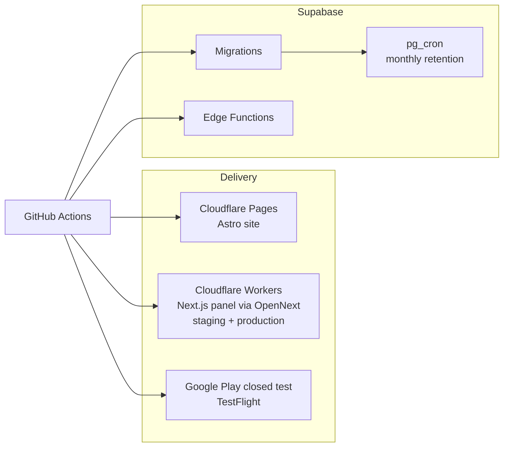

# Architecture

## The shape of the problem

WorkTracker has three audiences with incompatible needs.

Employees clock in from a phone, often in a warehouse, a basement or a site with no signal.
They need one button and an app that never blocks on the network.

Administrators and managers review incidents, approve corrections, configure the company and
export reports. That is desk work with wide tables, filters and PDF generation. It belongs on
a large screen.

Prospective customers and regulators need a public site: pricing, legal documents, privacy
policy, help.

One codebase serving all three would compromise all three. The system is therefore split into
four surfaces over one backend.

## Surfaces

| Surface | Stack | Owns |
|---|---|---|
| Mobile app | Flutter, Dart | The employee experience: clocking, personal history and reports, incidents, change requests, weekly confirmation. Also the manager routes: pending approvals, team, invitations, company settings |
| Administration panel | Next.js App Router, TypeScript | Company onboarding, dashboard, team and work centers, invitations, incident review, reports with PDF and CSV export, settings |
| Public site | Astro | Marketing, pricing, legal set, public help |
| Backend | Supabase: PostgreSQL, Auth, Edge Functions | Data, authentication, authorization, server-side operations, scheduled maintenance |

The mobile app is built on Clean Architecture with MVVM in the presentation layer, currently
around 730 source files. Domain entities hold no serialization and no framework dependencies.
Data sources and repositories return a `Result` type rather than throwing, so failure is part
of the signature and callers cannot ignore it. These are not stylistic preferences: they are
enforced by custom lint rules, described in the
[engineering workflow](ai-engineering-workflow.md).

## Boundaries

The important boundary is not between client and server. It is between operations that are
allowed to invent a fact and operations that are not.

Creating a clock-in, changing someone's membership status, resolving an incident, accepting an
invitation: each of these produces a record that carries labour consequences. They run through
Edge Functions and `SECURITY DEFINER` PostgreSQL functions that validate the caller, the
company, the sequence and the timing, and write the audit trail as part of the same
transaction. There are twelve such functions covering clocking, invitations, member
management, onboarding, change requests, rate limiting and notifications.

Reads and ordinary queries go directly to PostgreSQL, where Row Level Security scopes every
row to the caller's company. The panel resolves the caller's access state and capabilities in
Server Components, so authorization is decided before any markup reaches the browser.

Row Level Security is the floor, not the strategy. If a policy were the only thing standing
between two companies' data, a single mistaken policy would be a breach. The server-side
operation boundary exists so that policies are the second line of defence rather than the
first.

## Deployment

The public site deploys to Cloudflare Pages. The panel deploys to Cloudflare Workers through
OpenNext, with a staging worker and a production worker behind separate gates. Cloudflare also
provides CDN, DNS and WAF for both. Edge compute is Supabase, not Cloudflare Workers, so there
is one place where server-side business logic lives.

Mobile builds go to a closed Google Play test track and to TestFlight. The panel surfaces both
download paths in-product, including an explanation of what TestFlight is and that beta builds
expire after ninety days, because the alternative was a support conversation with every user.

## Cross-surface consistency

Two clients render the same data, which creates a class of bug that neither client can catch
alone: the Flutter manager report and the panel report can drift apart while both look
correct.

Three mechanisms keep them aligned.

The **product knowledge base** is a separate repository that records what the product does and
why, independent of any implementation. Business rules, role capabilities, flows and decisions
live there. When a change alters product behaviour, every task must close with an explicit
statement about whether that knowledge was updated.

The **time contract** is a single cross-surface specification for how instants, civil dates and
company-local display times are produced and consumed. It names its anti-patterns explicitly.
Both clients and the database implement it rather than each deriving its own answer. It exists
because they once did not. See [the failure case](failure-case-timezone.md).

**Shared server functions** mean report figures are computed once in PostgreSQL. Both clients
call the same function and render the result. Neither recalculates totals.

## Continuous integration

Every repository runs an internationalization consistency check, because a missing translation
key is a visible product defect rather than a lint warning. The panel additionally enforces
ESLint with zero tolerated warnings, TypeScript with no emit, Vitest unit tests, and Playwright
end-to-end runs across Chromium, Firefox and WebKit. Deployment is gated behind a separate
validation script rather than a build passing.

The backend carries 344 migrations and 92 pgTAP test files. Database behaviour that matters —
policy enforcement, idempotency, clock attestation, retention — is tested in the database,
because testing it in a client would only prove that the client happens to be well behaved.

## What is deliberately not here

**No microservices.** One backend, one database, one team of one. Distributed transactions
would be self-inflicted.

**No custom authentication.** Supabase Auth handles identity. Authorization is mine, because
that is where the product rules live.

**No employee features in the panel.** Employees who reach the panel see their account and
nothing else, and are pointed to the app. Building clocking twice would mean two
implementations of the rules that matter most, and one of them would be a browser tab that
cannot work offline. See [ADR-007](adr/007-panel-scope-admin-only.md).

**No paid subscription implementation yet.** Pricing is announced publicly. Company access is
gated by a single provider-agnostic access state, so integrating a payment provider later means
setting that state rather than restructuring the model. Earlier trial and subscription
scaffolding was removed once it became clear it was encoding assumptions about a provider that
had not been chosen.
