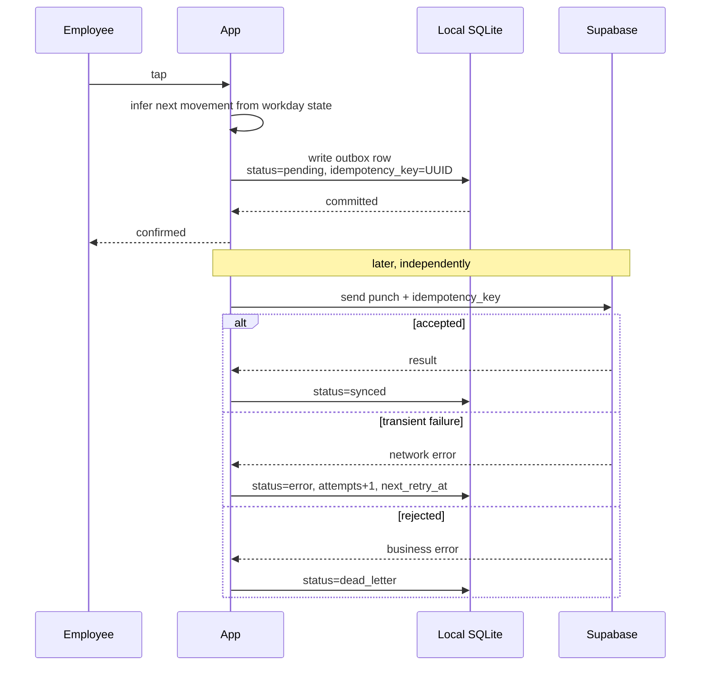
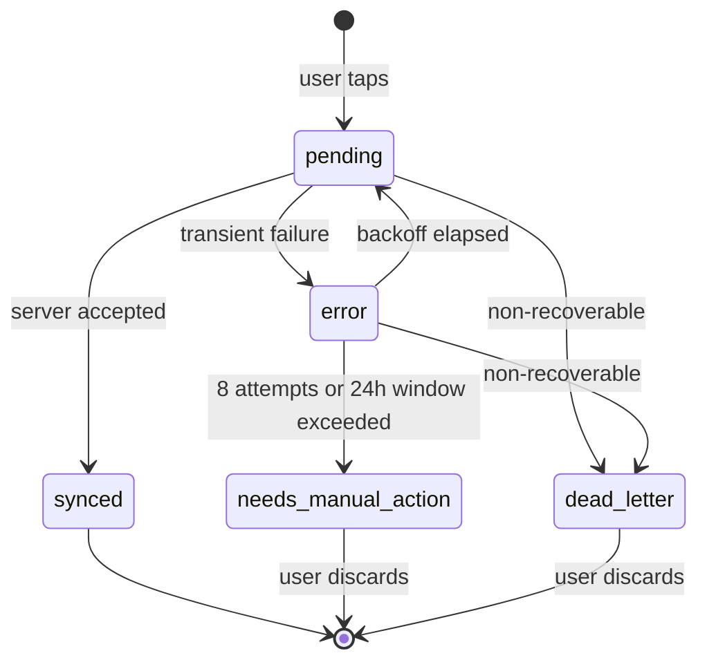

# Offline-first

## Why this is not optional

A clock-in is not a UI event. It is the record that says a person started work at a particular
time, and Spanish employers are required to keep it for four years and produce it on request.

The people creating those records work in warehouses with no signal, in building basements, on
construction sites and in vehicles. If the app requires a network round trip to register a
clock-in, then on a bad day the record either does not exist or exists with the wrong time,
and the employee is the one who has to argue about it later.

So the requirement is not "the app should degrade gracefully offline". It is: **the record is
created the moment the user taps, on the device, and nothing about the network can change
that.** Synchronization is a background concern that happens afterwards and must never be able
to lose or duplicate what was recorded.

## The model

The app writes to local SQLite first and treats the server as a destination rather than a
source of truth for the act of clocking in.

The user's confirmation comes from the local commit, not from the server. Everything after
that point is recovery.

## Duplicates, not conflicts

The obvious design for offline sync is conflict resolution: detect that two versions of the
same thing disagree, then apply a policy such as last write wins.

That is the wrong model here, and choosing it would have caused real damage.

Clock movements are append-only facts. Two devices do not edit the same workday record into
different states. There is no meaningful sense in which a later write should overwrite an
earlier one, and a last-write-wins policy applied to labour records would silently discard
evidence. The actual risk is different: **the same real-world action producing two records**,
because the app retried, or the user tapped again after a spinner, or the process was killed
between the network call and the local acknowledgement.

So the mechanism is deduplication, not reconciliation.

Every outbox row carries an idempotency key generated once, when the punch intent is created,
and stored under a uniqueness constraint locally. The same key travels with every retry. The
server honours that key for 72 hours: a repeat of the same logical punch returns the original
response without creating a second movement, while a genuinely new key creates a new one.

The key is carried inside the punch metadata rather than as a separate parameter. That is a
small decision with a reason: making it a first-class argument would have created a second
source of truth for a value that already belongs to the punch, and would have forced a
signature change on a function that several paths call.

The consequence is that the retry logic can be aggressive without being dangerous. Within the
deduplication window, an uncertain outcome can be retried safely using the same idempotency
key.

## Retry and failure

The synchronization coordinator processes the outbox in order, in batches of twenty, with a
guard that collapses concurrent sync requests into the single run already in flight. It is
triggered by the connectivity stream when the device regains a connection, and also manually
when the app resumes or after login.

Failures are classified before they are retried.

**Transient** failures are network-level. They back off exponentially from two seconds, capped
at five minutes, with 25% jitter so that a fleet of devices reconnecting to the same site
network does not arrive as a thundering herd. Up to eight attempts, within a total window of
24 hours.

**Non-recoverable** failures skip retrying entirely. Retrying a rejected punch produces the
same rejection more slowly.

An outbox row therefore moves through a small, explicit set of states:

The two terminal states matter more than the happy path. A system that retries forever is a
system that hides a stuck record behind an optimistic spinner. `dead_letter` and
`needs_manual_action` are deliberate admissions that automation is finished and a human has to
look, and the app exposes both, with an explicit action to discard a terminal item once the
user has dealt with it.

## What the user sees

Sync state is visible rather than implicit. The app carries a global status covering four
cases: synced, pending, offline, and terminal error. Individual punches carry their own
status, so a user with one stuck record and nine synced ones sees exactly that instead of a
single ambiguous warning.

Feature availability while offline is declared in one place: a map from feature to a boolean,
read at three enforcement points — the shell disables tabs, the router redirects blocked
routes, and a gate widget wraps blockable sections.

The alternative, which the codebase comments call out explicitly, was an `if (isOffline)`
check scattered through every screen and view model. That version is easier to write for the
first screen and worse forever after, because the policy stops being inspectable and every new
screen is a new opportunity to forget. Adding or removing offline support for a feature is now
a one-line change to the map.

Clocking, the dashboard, personal history and settings work offline. Workday detail, incidents,
the administrative surface and company settings do not, because they read data the device does
not hold and would show a plausible but stale answer.

## Trusting the device clock without believing it

Offline records carry the timestamp the device believed at the moment of the punch. Device
clocks are wrong, sometimes accidentally and sometimes not.

The system records, for each punch that comes through the canonical path, the server
transaction time alongside the client's timestamp, and stores the signed difference between
them. Punches more than ten minutes behind or more than one minute ahead are flagged for
manager review.

Flagging is not rejection, and the distinction is the whole point. A punch uploaded after four
hours in a basement will show a large positive skew, and it is completely legitimate. The
system cannot tell that case apart from a manipulated clock, so it does not try. It records
what it observed, surfaces the anomaly, and leaves the judgement to the manager who has the
context.

## Trade-offs accepted

**The local database is a real database.** It has a versioned schema and explicit upgrade
paths, currently past its seventh revision. Every schema change carries a migration for
devices holding unsynced records, and getting one wrong destroys data that exists nowhere else.

**Sync quality is measured, not assumed.** The coordinator tracks attempts, successes,
conflicts, time of last successful sync, and the quality of geolocation captured at enqueue
time. Without this, "sync works" would be an anecdote.

**Geolocation is captured when the punch is enqueued**, not when it is sent, since the position
at send time is not where the person was when they clocked in. When the company has not
enabled geolocation, nothing is captured.

**Offline support is a permanent cost, not a feature that ships once.** Every new employee-facing
feature has to answer whether it works offline, and the honest answer is often no. Making that
answer explicit and centralized was cheaper than making it implicit and everywhere.
